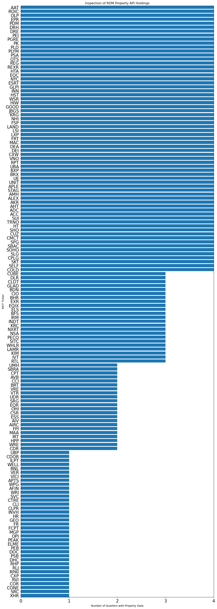
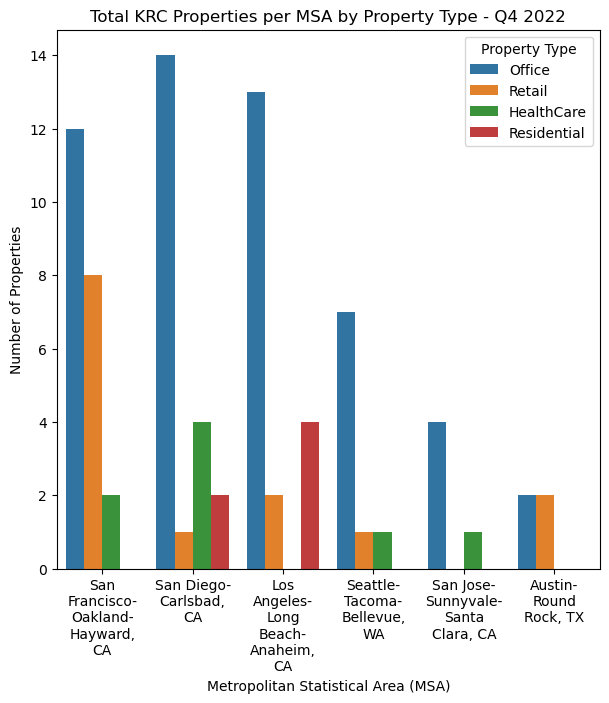
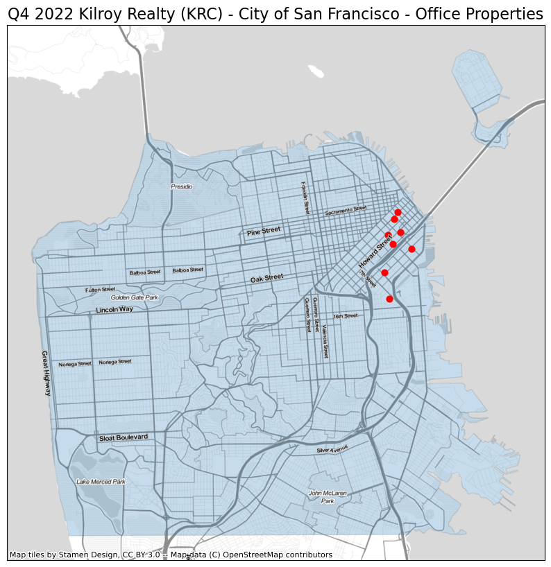

# RDM Property and Analytics API Tutorial # 1

This notebook will leverage the REIT Data Market (RDM) Property API to collect, process and visualze Kilroy Realty (KRC) property locations.

## Notebook Requirements

- Python >= 3.9 (although older versions may work)
- Data Science Libraries
- San Francisco Counties GeoJSON

### Downloading San Francisco Counties GeoJSON

Execute the below to download the required data. Optionally, naviagte to the URL in a web browser.


```python
SF_NEIGHBORHOODS = "./sf_neighborhoods.geojson"
```


```python
!curl "https://data.sfgov.org/api/geospatial/pty2-tcw4?method=export&format=GeoJSON" --output $SF_NEIGHBORHOODS
```

      % Total    % Received % Xferd  Average Speed   Time    Time     Time  Current
                                     Dload  Upload   Total   Spent    Left  Speed
    100  286k    0  286k    0     0   417k      0 --:--:-- --:--:-- --:--:--  416k


```python
import json
import os
import textwrap

import contextily as cx
import geopandas as gpd
import matplotlib.pyplot as plt
import numpy as np
import pandas as pd
import requests
import seaborn as sns
from matplotlib import style
from matplotlib.ticker import FormatStrFormatter
```

Load the API key, create Rapid API headers, and set a base URL to use for queries.


```python
API_KEY = os.environ["RDM_RAPID_API_KEY"]

BASE_URL = "https://reit-property-data1.p.rapidapi.com"

HEADERS = {
    "X-RapidAPI-Key": API_KEY,
    "X-RapidAPI-Host": "reit-property-data1.p.rapidapi.com",
}
```

## GET /reit-index

Search the RDM Universe to idenitfy the number of quarters of data available for each REIT.


```python
url = f"{BASE_URL}/reit-index"

response = requests.request("GET", url, headers=HEADERS)
data = response.json()
```


```python
print(f'Number of REITs in RDM universe across all quarters is {len(data["reits"])}')
```

    Number of REITs in RDM universe across all quarters is 149


Loop through the list of tickers and create a Heat Map of of the RDM Universe


```python
sum_quarters = [len(data["reits"][ticker].keys()) for ticker in data["reits"]]
df = pd.DataFrame({"REIT": data["reits"].keys(), "TotalQuarters": sum_quarters})

df.head()
```


<div>
<style scoped>
    .dataframe tbody tr th:only-of-type {
        vertical-align: middle;
    }

    .dataframe tbody tr th {
        vertical-align: top;
    }

    .dataframe thead th {
        text-align: right;
    }
</style>
<table border="1" class="dataframe">
  <thead>
    <tr style="text-align: right;">
      <th></th>
      <th>REIT</th>
      <th>TotalQuarters</th>
    </tr>
  </thead>
  <tbody>
    <tr>
      <th>0</th>
      <td>AAT</td>
      <td>4</td>
    </tr>
    <tr>
      <th>1</th>
      <td>ACC</td>
      <td>4</td>
    </tr>
    <tr>
      <th>2</th>
      <td>ADC</td>
      <td>4</td>
    </tr>
    <tr>
      <th>3</th>
      <td>AFIN</td>
      <td>1</td>
    </tr>
    <tr>
      <th>4</th>
      <td>AHT</td>
      <td>4</td>
    </tr>
  </tbody>
</table>
</div>


Create a Horizontal bar chart of RDM Property Data Holdings


```python
df.sort_values(by="TotalQuarters", ascending=True, inplace=True)

fig, ax = plt.subplots(figsize=(13, 40))
ax.barh(df["REIT"], df["TotalQuarters"], align="center")

ax.set_xlabel("Number of Quarters with Property Data")
ax.set_ylabel("REIT Ticker")
ax.set_title("Inspection of RDM Property API Holdings")
ax.tick_params(axis="both", which="major", labelsize=16)

# Make x-axis with minor ticks that are multiples
# of 1 and label minor ticks with '% 1.2f' formatting
plt.xticks(np.arange(min(df["TotalQuarters"]) - 1, max(df["TotalQuarters"]) + 1, 1.0))
ax.xaxis.set_major_formatter(FormatStrFormatter("%.0f"))
ax.margins(x=0)
plt.margins(y=0)

plt.show()
```





## GET /property

Find properties in for Kilroy Realty (KRC) in Q4 2022. This method returns a list of property IDs.


```python
# Get property IDs for Kilroy Realty for properties owned in Q4 2022

url = f"{BASE_URL}/property"

querystring = {"reit": "krc", "qy": "Q42022"}

response = requests.request("GET", url, headers=HEADERS, params=querystring)

results = response.json()
property_ids = results["property_ids"]
property_ids[:5]  # Show the first 5
```


    [305321, 305335, 305338, 305346, 305353]


## GET /property-basic-info

Let's see ane example response from the `/property-basic-info` endpoint.


```python
url = f"{BASE_URL}/property-info-basic"
querystring = {"property_id": property_ids[0]}
response = requests.request("GET", url, headers=HEADERS, params=querystring)
response.json()
```


    {'id': 305321,
     'reit': 'KRC',
     'name': '909 & 999 N. Pacific Coast Highway',
     'property_type': 'Office',
     'qy': 'Q42022',
     'address': '909 & 999 North Pacific Coast Highway',
     'city': 'El Segundo',
     'state': 'CA',
     'zip': '90245',
     'country': 'US',
     'county': 'Los Angeles',
     'countygeoid': 6037,
     'msa': 'Los Angeles-Long Beach-Anaheim, CA',
     'msageoid': 31080}


Now loop through property ids and acquire basic property information for each property owned by KRC.


```python
property_data = []
for property_id in property_ids:
    url = f"{BASE_URL}/property-info-basic"

    querystring = {"property_id": str(property_id)}

    response = requests.request("GET", url, headers=HEADERS, params=querystring)
    property_data.append(response.json())
```

Make a DataFrame with the results.


```python
df = pd.DataFrame(property_data)
df.head()
```


<div>
<style scoped>
    .dataframe tbody tr th:only-of-type {
        vertical-align: middle;
    }

    .dataframe tbody tr th {
        vertical-align: top;
    }

    .dataframe thead th {
        text-align: right;
    }
</style>
<table border="1" class="dataframe">
  <thead>
    <tr style="text-align: right;">
      <th></th>
      <th>id</th>
      <th>reit</th>
      <th>name</th>
      <th>property_type</th>
      <th>qy</th>
      <th>address</th>
      <th>city</th>
      <th>state</th>
      <th>zip</th>
      <th>country</th>
      <th>county</th>
      <th>countygeoid</th>
      <th>msa</th>
      <th>msageoid</th>
    </tr>
  </thead>
  <tbody>
    <tr>
      <th>0</th>
      <td>305321</td>
      <td>KRC</td>
      <td>909 &amp; 999 N. Pacific Coast Highway</td>
      <td>Office</td>
      <td>Q42022</td>
      <td>909 &amp; 999 North Pacific Coast Highway</td>
      <td>El Segundo</td>
      <td>CA</td>
      <td>90245</td>
      <td>US</td>
      <td>Los Angeles</td>
      <td>6037</td>
      <td>Los Angeles-Long Beach-Anaheim, CA</td>
      <td>31080</td>
    </tr>
    <tr>
      <th>1</th>
      <td>305335</td>
      <td>KRC</td>
      <td>Menlo Point</td>
      <td>Office</td>
      <td>Q42022</td>
      <td>4100-4700 Bohannon Drive</td>
      <td>Menlo Park</td>
      <td>CA</td>
      <td>94025</td>
      <td>US</td>
      <td>San Mateo</td>
      <td>6081</td>
      <td>San Francisco-Oakland-Hayward, CA</td>
      <td>41860</td>
    </tr>
    <tr>
      <th>2</th>
      <td>305338</td>
      <td>KRC</td>
      <td>Page Mill/Porter</td>
      <td>HealthCare</td>
      <td>Q42022</td>
      <td>1701 Page Mill Road &amp; 3150 Porter Drive</td>
      <td>Palo Alto</td>
      <td>CA</td>
      <td>94304</td>
      <td>US</td>
      <td>Santa Clara</td>
      <td>6085</td>
      <td>San Jose-Sunnyvale-Santa Clara, CA</td>
      <td>41940</td>
    </tr>
    <tr>
      <th>3</th>
      <td>305346</td>
      <td>KRC</td>
      <td>One Paseo</td>
      <td>Residential</td>
      <td>Q42022</td>
      <td>3725 Paseo Place</td>
      <td>San Diego</td>
      <td>CA</td>
      <td>09213</td>
      <td>US</td>
      <td>San Diego</td>
      <td>6073</td>
      <td>San Diego-Carlsbad, CA</td>
      <td>41740</td>
    </tr>
    <tr>
      <th>4</th>
      <td>305353</td>
      <td>KRC</td>
      <td>9455 Towne Centre Drive</td>
      <td>Office</td>
      <td>Q42022</td>
      <td>9455 Towne Centre Drive</td>
      <td>San Diego</td>
      <td>CA</td>
      <td>92121</td>
      <td>US</td>
      <td>San Diego</td>
      <td>6073</td>
      <td>San Diego-Carlsbad, CA</td>
      <td>41740</td>
    </tr>
  </tbody>
</table>
</div>


### Visualize the number of properties per MSA by Type

[This medium blog](https://medium.com/dunder-data/automatically-wrap-graph-labels-in-matplotlib-and-seaborn-a48740bc9ce) was used to wrap labels with the seaborn library.


```python
fig, ax = plt.subplots(figsize=(7, 7))
top10 = df["msa"].value_counts().index[:10]
ax.set_title("Total KRC Properties per MSA by Property Type - Q4 2022")
sns.countplot(
    data=df,
    x="msa",
    hue="property_type",
    order=top10,
    hue_order=["Office", "Retail", "HealthCare", "Residential"],
)
ax.legend(bbox_to_anchor=(1, 1), title="Property Type")


def wrap_labels(ax, width, break_long_words=False):
    labels = []
    for label in ax.get_xticklabels():
        text = label.get_text()
        labels.append(
            textwrap.fill(text, width=width, break_long_words=break_long_words)
        )
    ax.set_xticklabels(labels, rotation=0)


# wrap the labels
wrap_labels(ax, 10)

ax.figure
ax.set_xlabel("Metropolitan Statistical Area (MSA)")
ax.set_ylabel("Number of Properties")
plt.show()
```





## GET /property-info-premium

Query premium attributes for KRC properties like latitude and longitude.


```python
location_info = []
for property_id in property_ids:
    url = f"{BASE_URL}/property-info-premium"

    querystring = {"property_id": property_id, "attribute": "location"}

    response = requests.request("GET", url, headers=HEADERS, params=querystring)
    location_info.append(response.json())
```

Make a DataFrame with the results.


```python
location_df = pd.json_normalize(location_info)
location_df.columns = ["id", "lat", "lon"]
location_df.head()
```


<div>
<style scoped>
    .dataframe tbody tr th:only-of-type {
        vertical-align: middle;
    }

    .dataframe tbody tr th {
        vertical-align: top;
    }

    .dataframe thead th {
        text-align: right;
    }
</style>
<table border="1" class="dataframe">
  <thead>
    <tr style="text-align: right;">
      <th></th>
      <th>id</th>
      <th>lat</th>
      <th>lon</th>
    </tr>
  </thead>
  <tbody>
    <tr>
      <th>0</th>
      <td>305321</td>
      <td>33.930000</td>
      <td>-118.397000</td>
    </tr>
    <tr>
      <th>1</th>
      <td>305335</td>
      <td>37.480810</td>
      <td>-122.177378</td>
    </tr>
    <tr>
      <th>2</th>
      <td>305338</td>
      <td>37.408308</td>
      <td>-122.152492</td>
    </tr>
    <tr>
      <th>3</th>
      <td>305346</td>
      <td>32.952865</td>
      <td>-117.234709</td>
    </tr>
    <tr>
      <th>4</th>
      <td>305353</td>
      <td>32.878944</td>
      <td>-117.206784</td>
    </tr>
  </tbody>
</table>
</div>


Join location data to other attributes.


```python
df = df.merge(location_df, on="id", how="left")
df.head()
```


<div>
<style scoped>
    .dataframe tbody tr th:only-of-type {
        vertical-align: middle;
    }

    .dataframe tbody tr th {
        vertical-align: top;
    }

    .dataframe thead th {
        text-align: right;
    }
</style>
<table border="1" class="dataframe">
  <thead>
    <tr style="text-align: right;">
      <th></th>
      <th>id</th>
      <th>reit</th>
      <th>name</th>
      <th>property_type</th>
      <th>qy</th>
      <th>address</th>
      <th>city</th>
      <th>state</th>
      <th>zip</th>
      <th>country</th>
      <th>county</th>
      <th>countygeoid</th>
      <th>msa</th>
      <th>msageoid</th>
      <th>lat</th>
      <th>lon</th>
    </tr>
  </thead>
  <tbody>
    <tr>
      <th>0</th>
      <td>305321</td>
      <td>KRC</td>
      <td>909 &amp; 999 N. Pacific Coast Highway</td>
      <td>Office</td>
      <td>Q42022</td>
      <td>909 &amp; 999 North Pacific Coast Highway</td>
      <td>El Segundo</td>
      <td>CA</td>
      <td>90245</td>
      <td>US</td>
      <td>Los Angeles</td>
      <td>6037</td>
      <td>Los Angeles-Long Beach-Anaheim, CA</td>
      <td>31080</td>
      <td>33.930000</td>
      <td>-118.397000</td>
    </tr>
    <tr>
      <th>1</th>
      <td>305335</td>
      <td>KRC</td>
      <td>Menlo Point</td>
      <td>Office</td>
      <td>Q42022</td>
      <td>4100-4700 Bohannon Drive</td>
      <td>Menlo Park</td>
      <td>CA</td>
      <td>94025</td>
      <td>US</td>
      <td>San Mateo</td>
      <td>6081</td>
      <td>San Francisco-Oakland-Hayward, CA</td>
      <td>41860</td>
      <td>37.480810</td>
      <td>-122.177378</td>
    </tr>
    <tr>
      <th>2</th>
      <td>305338</td>
      <td>KRC</td>
      <td>Page Mill/Porter</td>
      <td>HealthCare</td>
      <td>Q42022</td>
      <td>1701 Page Mill Road &amp; 3150 Porter Drive</td>
      <td>Palo Alto</td>
      <td>CA</td>
      <td>94304</td>
      <td>US</td>
      <td>Santa Clara</td>
      <td>6085</td>
      <td>San Jose-Sunnyvale-Santa Clara, CA</td>
      <td>41940</td>
      <td>37.408308</td>
      <td>-122.152492</td>
    </tr>
    <tr>
      <th>3</th>
      <td>305346</td>
      <td>KRC</td>
      <td>One Paseo</td>
      <td>Residential</td>
      <td>Q42022</td>
      <td>3725 Paseo Place</td>
      <td>San Diego</td>
      <td>CA</td>
      <td>09213</td>
      <td>US</td>
      <td>San Diego</td>
      <td>6073</td>
      <td>San Diego-Carlsbad, CA</td>
      <td>41740</td>
      <td>32.952865</td>
      <td>-117.234709</td>
    </tr>
    <tr>
      <th>4</th>
      <td>305353</td>
      <td>KRC</td>
      <td>9455 Towne Centre Drive</td>
      <td>Office</td>
      <td>Q42022</td>
      <td>9455 Towne Centre Drive</td>
      <td>San Diego</td>
      <td>CA</td>
      <td>92121</td>
      <td>US</td>
      <td>San Diego</td>
      <td>6073</td>
      <td>San Diego-Carlsbad, CA</td>
      <td>41740</td>
      <td>32.878944</td>
      <td>-117.206784</td>
    </tr>
  </tbody>
</table>
</div>


### Plot Office Properties Located in the City of San Francisco on a Map

Use the geopandas library to load and read polygon file of San Francisco neighborhoods.


```python
sf_neighborhoods = gpd.read_file(SF_NEIGHBORHOODS)
sf_neighborhoods = sf_neighborhoods.to_crs("EPSG:4326")

# Filter to only San Francisco properties
sfprops = df.loc[(df["city"] == "San Francisco") & (df["property_type"] == "Office")]
sf_gpd = gpd.GeoDataFrame(
    sfprops, geometry=gpd.points_from_xy(sfprops.lon, sfprops.lat), crs="EPSG:4326"
)
```


```python
fig, ax = plt.subplots(1, 1, figsize=(10, 25))

sf_neighborhoods_cx = sf_neighborhoods.to_crs(epsg="3857", inplace=False)
ax = sf_neighborhoods_cx.plot(edgecolor="grey", ax=ax, legend=False, alpha=0.25)
sf_gpd.to_crs(epsg="3857", inplace=True)
ax1 = sf_gpd.plot(ax=ax, color="red", markersize=40)


# Add basemap
cx.add_basemap(ax1, source=cx.providers.Stamen.TonerLite, zoom=13)
cx.add_basemap(ax1, source=cx.providers.Stamen.TonerLabels, zoom=13)

# Style the map
plt.tick_params(
    left=False, right=False, labelleft=False, labelbottom=False, bottom=False
)

plt.title(
    "Q4 2022 Kilroy Realty (KRC) - City of San Francisco - Office Properties", size=16
)

plt.show()
```





For help with this tutorial or for any other questions regarding the RDM Property and Analytics API, reach out to analytics@reitdatamarket.com
